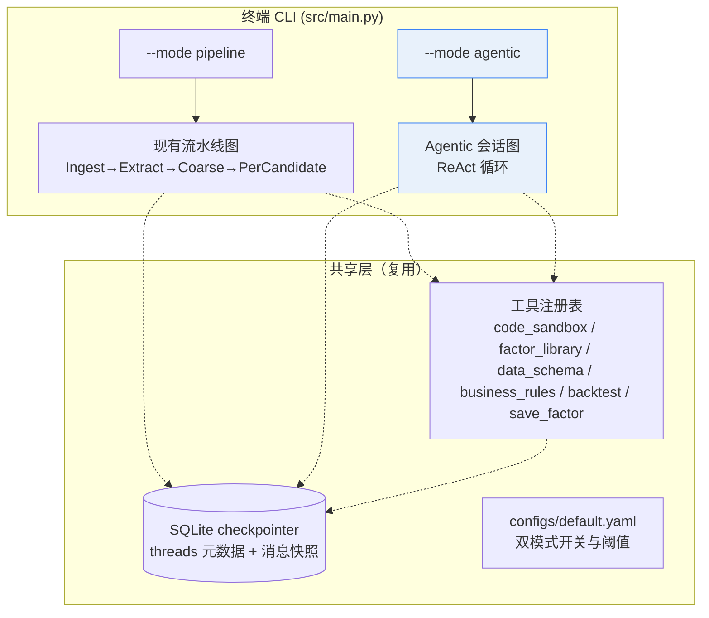
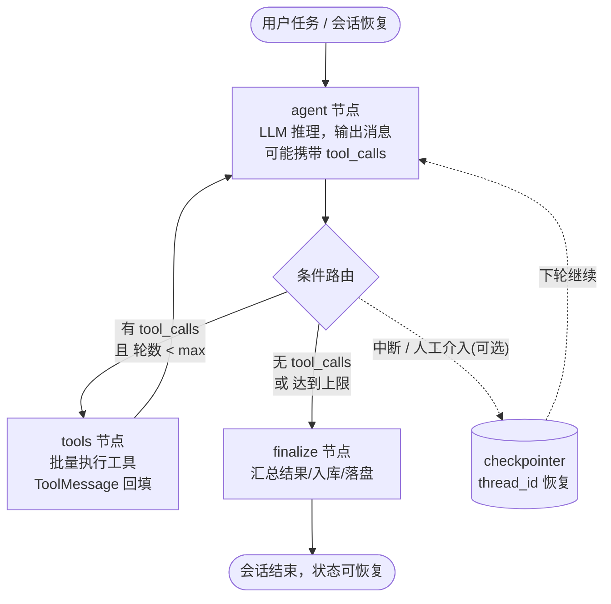

# Factor Miner Agent · Claude Code 式长程会话改造规划

> 版本：v0.1（规划稿，待决策点确认后进入实施）
> 创建日期：2026-09-15
> 目标分支：`feat/claude-code-like-agent`（本文档所在分支）
> 配套文档：[技术设计文档](./single_factor_miner_agent_design.md) · [开发进度看板](./progress/README.md)
> 框架：LangGraph（StateGraph 手写 ReAct）+ OpenAI Chat Completions 兼容接口（tool_calls）

---

## 0. 结论先行

- **核心判断**：当前智能体是"确定性流水线"（每个节点做一件固定的事），Claude Code 是"自主 ReAct 循环"（模型自己决定调什么工具、调几次、何时停）。二者本质不同，改造不是修修补补，而是新增一层**自主智能体会话层**。
- **推荐策略**：**双模式并存**——保留现有流水线模式（`--mode pipeline`，保底、可复现、已验收），新增 Agentic 会话模式（`--mode agentic`，默认入口）。两者共享工具层与数据层，通过配置切换，风险可控、可回退。
- **实现路径**：手写 `StateGraph`（不用 `create_react_agent` 高层封装），以便精确控制消息结构、复用现有 SQLite checkpointer、叠加因子挖掘领域约束（PIT 校验、工具输出校验）。
- **排期**：6 个自然周（W38–W43，2026-09-14 ~ 2026-10-25），已避开中秋 / 国庆假期窗口，详见 §5。
- **前置确认**：本文档 §7 列出 6 个决策点（Q1–Q6），其中 Q1（模式策略）、Q2（交互形态）、Q3（模型）在开工前需要你拍板，其余可并行细化。

---

## 1. 背景与目标

### 1.1 现状一句话

`factor_miner` 已是一个跑通的 LangGraph 流水线智能体：研报 → 候选抽取 → 粗筛 → 每候选子图（细筛/迭代/生成代码/沙箱执行/修复/相关性/回测）→ 入库留档，带 SQLite 断点续跑。

### 1.2 改造目标

对齐 Claude Code 的四项核心能力，全部落到本项目的量化因子挖掘场景：

| # | 能力 | 含义 |
|---|---|---|
| 1 | **自主工具调用循环（ReAct）** | 模型自主决定调用哪个工具、连续调用多少轮、何时结束，而不是走固定节点序列 |
| 2 | **长程会话管理** | 一次会话可跨越大量工具轮次与用户追问；中断可恢复；多会话并存可切换 |
| 3 | **流式输出** | 每一步"思考 → 工具调用 → 工具返回"实时可见，用户像看 Claude Code 一样观察执行过程 |
| 4 | **安全终止保护** | 最大轮数、工具输出截断、沙箱隔离、超时兜底，杜绝死循环与上下文撑爆 |

### 1.3 非目标（Scope Out）

- 不做 Web / 桌面 GUI（本期只做终端 CLI）。
- 不重写现有流水线节点（它们保留为 `pipeline` 模式复用）。
- 不做多智能体协作（本期单智能体 + 工具，多 Agent 留作后续）。
- 不做代码沙盒安全体系的根本重构（沿用现有 subprocess + conda 隔离 + AST 校验，扩展为通用执行工具时再评估 E2B / 容器化）。

---

## 2. 现状与差距分析

### 2.1 当前架构快照（代码级核实）

| 模块 | 文件 | 现状 |
|---|---|---|
| 主图 | `src/graph.py` | `StateGraph(MinerState)`：Ingest → Extract → Coarse → `Send()` 扇出 PerCandidate 子图 |
| 子图 | `src/graph.py` | FineFilter → Iterate → GenerateFactor → CodeExec → CodeFix → RelevanceCheck → Backtest → Save，条件边路由 |
| 状态 | `src/state.py` | `MinerState` + `PerCandidateState`，**无消息栈字段** |
| LLM 客户端 | `src/llm.py` | `chat_messages()` **已支持传入 `tools` 参数，但只返回 `content` 字符串，`tool_calls` 被丢弃**；无流式 |
| 沙箱 | `src/tools/code_sandbox.py` | `run_factor_code()`：AST 校验（禁 import/文件读/未来函数）+ subprocess 跑 `factor-calc` conda 环境，超时兜底 |
| 领域工具 | `src/tools/` | `factor_library.py`（因子库）、`data_schema.py`（数据字典）、`business_rule.py`（业务规则），均为 Python 类而非 Agent 工具 |
| 持久化 | `src/persistence.py` + `src/graph.py` | SQLite checkpointer（`SqliteSaver` + `NumpySafeSerializer`），`main.py --resume <run_id>` 已可用 |
| 配置 | `configs/default.yaml` | 模型 `qwen3.7-flash-2026-07-15`（DashScope MaaS，OpenAI 兼容），节点级 override（`deepseek-v4-flash-0731`） |
| 入口 | `src/main.py` | `--material / --resume / --run-id / --config`，单次流水线执行 |

### 2.2 能力差距矩阵

| 维度 | Claude Code 式目标 | 当前实现 | 差距 / 改造量 |
|---|---|---|---|
| 执行模型 | 模型自主 ReAct 循环 | 固定 DAG 节点序列，LLM 只做单点任务 | **大**：新增 agent/tools 循环 |
| 工具调用 | 任意轮次 tool_calls | 无（`chat_messages` 丢弃 tool_calls） | **大**：LLM 客户端扩展 + 工具注册表 |
| 消息栈 | user/assistant/tool 完整历史 | 仅 CodeFix 内部构造多轮 messages，不进图状态 | **大**：State 增加消息栈 |
| 会话管理 | thread_id 多会话、中断恢复 | 有 checkpointer，但 thread_id = run_id，无会话元数据 | **中**：会话化封装 |
| 流式 | 边执行边看 | 无（同步 invoke，只有日志） | **中**：LLM SSE + graph.stream |
| 终止保护 | 轮数/截断/超时 | 仅有 CodeFix 10 轮、沙箱 60s | **中**：全局轮数与截断 |
| 领域工具 | 因子库/字典/规则/沙箱可自主调用 | 工具被硬编码进各节点 | **中**：改造成 Agent 工具 |
| 长上下文 | 摘要压缩 | 无 | **小（v2）**：压缩节点 |

### 2.3 可直接复用资产（改造红利）

- ✅ SQLite checkpointer + 自定义 serializer（会话恢复的地基，无需重写）
- ✅ `code_sandbox.run_factor_code`（成熟的因子代码执行 + PIT 静态检查，直接注册为工具）
- ✅ `FactorLibrary` / `DataSchema` / `BusinessRules`（查询逻辑现成，包一层 tool schema 即可）
- ✅ 回测 / 相关性 / 入库逻辑（`backtest.py`、`relevance_check.py`、`persistence.py`）
- ✅ `configs/default.yaml` 配置体系与 LLM 重试（tenacity）

### 2.4 必须新造的部分

1. `LLMClient` 扩展：返回完整 message（含 `tool_calls`）+ 流式接口
2. 会话状态定义与消息模型（`AgentSessionState`）
3. 工具注册表（schema + 执行函数 + 输出校验）
4. ReAct 主循环图（agent / tools / 条件路由 / finalize）
5. 会话持久化元数据（threads 表：任务、状态、摘要、恢复点）
6. CLI 交互入口（`--mode agentic`）
7. 终止保护与上下文压缩节点

---

## 3. 目标架构设计

### 3.1 总体架构（双模式）



**决策理由**：
- 双模式并存 = 新能力上线不影响已验证的流水线，出问题一键 `--mode pipeline` 回退；
- 共享工具层 = 两模式对同一批因子挖掘能力，避免双份维护；
- Agentic 图独立于流水线图 = 状态、checkpointer 配置互不污染。

### 3.2 ReAct 核心循环（手写 StateGraph）

与 Claude Code 的 `User → Assistant(tool_calls) → Tool → ToolResult → Assistant(…/结束)` 一一对应：



伪代码（与用户参考一致，落地到本项目）:

```python
class AgentSessionState(TypedDict, total=False):
    thread_id: str
    task: str                              # 用户本轮任务
    material_path: str | None              # 可选输入
    messages: Annotated[list[dict], operator.add]   # OpenAI 格式消息栈
    agent_rounds: int                      # 已执行轮数（终止保护）
    tool_calls_count: int
    candidates: list[CandidateRecord]      # 因子挖掘产出
    errors: Annotated[list[str], operator.add]

def agent_node(state):
    resp = llm.chat_messages(state["messages"], tools=TOOL_SCHEMAS)  # 扩展后返回完整 message
    return {"messages": [resp.as_dict()], "agent_rounds": state.get("agent_rounds", 0) + 1}

def tools_node(state):
    last = state["messages"][-1]
    results = []
    for call in last.get("tool_calls", []):
        try:
            out = TOOL_REGISTRY[call["name"]]["fn"](**call["arguments"])
        except Exception as e:
            out = {"error": str(e)}
        results.append({
            "role": "tool", "tool_call_id": call["id"],   # 必须原样回传，否则模型报错
            "content": json.dumps(out, ensure_ascii=False)[:TOOL_OUTPUT_TRUNCATE],
        })
    return {"messages": results, "tool_calls_count": len(results)}

def route_after_agent(state):
    last = state["messages"][-1]
    if state.get("agent_rounds", 0) >= cfg.max_agent_rounds: return "finalize"
    if last.get("tool_calls"): return "tools"
    return "finalize"

builder = StateGraph(AgentSessionState)
builder.add_node("agent", agent_node)
builder.add_node("tools", tools_node)
builder.add_node("finalize", finalize_node)
builder.set_entry_point("agent")
builder.add_conditional_edges("agent", route_after_agent,
    {"tools": "tools", "finalize": "finalize"})
builder.add_edge("tools", "agent")
builder.add_edge("finalize", END)
graph = builder.compile(checkpointer=checkpointer)
```

### 3.3 状态与消息模型设计

- **消息格式**：沿用 OpenAI Chat Completions 原生 dict（`role/content/tool_calls/tool_call_id`），与现有 `LLMClient` 及 qwen 兼容接口零转换成本，避免引入 langchain 消息模型带来的依赖膨胀。
- **状态字段**：`AgentSessionState`（见上），`messages` 用 `operator.add` 归约以支持节点增量返回。
- **与流水线状态的关系**：两套状态完全独立；Agentic 会话的 `finalize` 可调用流水线已有组件（如 `RunRecorder`）复用留档逻辑。

### 3.4 工具集设计（首批）

将现有能力封装为 OpenAI tools 格式（`name` + `description` + `parameters` JSON Schema），注册表驱动：

| 工具名 | 对应现有实现 | 用途 | 输出 |
|---|---|---|---|
| `run_factor_code` | `code_sandbox.run_factor_code` | 提交因子代码，沙箱跑出因子值 parquet | 成功/失败 + 截断报错 |
| `query_factor_library` | `FactorLibrary` | 查因子库描述/公式，做新颖性自查 | 匹配条目 + 相关性提示 |
| `query_data_schema` | `DataSchema.summary_for_llm` | 查可用字段、频率、口径 | 字段清单 |
| `query_business_rules` | `BusinessRules` | 查业务合规规则 | 规则条目 |
| `run_backtest` | `backtest_node` 逻辑 | 对已产出的因子值跑 IC/IR | IC/IR/换手等指标 |
| `save_factor` | `persistence.RunRecorder` | 因子入库留档 | 入库确认 |
| `read_material` | `ingest_node` 逻辑 | 读取研报/论文/纪要文本 | 分页文本（截断） |

> 说明：首批 7 个工具全部来自现有已验收逻辑，**零新沙箱能力**。通用代码执行 / shell（像 Claude Code 那样跑任意命令）列入 Q4 决策，如需要再评估独立安全边界。

### 3.5 会话管理

- **checkpointer 复用**：`SqliteSaver` 已具备；Agentic 模式下 `thread_id` 即会话 ID，`graph.invoke(..., config={"configurable": {"thread_id": sid}})` 天然支持中断恢复。
- **会话元数据**（新增 `threads` 表或 `threads.json`）：`thread_id`、任务摘要、创建/更新时间、状态（active/done）、最后 N 轮摘要。
- **CLI 交互**：
  - `python -m src.main --mode agentic --task "从研报X提炼2个因子" [--material path] [--resume <sid>]`
  - `--list-sessions` 列出历史会话，`--resume` 从任意会话恢复，续聊不重建上下文。
- **多会话隔离**：不同 `thread_id` 的 checkpointer 命名空间天然隔离，互不串扰。

### 3.6 流式输出

- `LLMClient.chat_stream()`：基于 `client.chat.completions.create(stream=True)` 逐 chunk 产出 content 与 tool_calls 增量。
- 图侧 `graph.stream(initial, config, stream_mode="updates")`：按节点粒度输出，终端实时打印 `[agent] 思考… → [tools] run_factor_code → [agent] 继续…`，与 Claude Code 的逐条过程展示对齐。

### 3.7 安全与终止保护

| 保护项 | 默认值 | 说明 |
|---|---|---|
| `max_agent_rounds` | 30 | 超限强制走 finalize，防 LLM 死循环 |
| `tool_output_truncate_chars` | 8000 | 单条工具结果截断，防上下文撑爆 |
| `messages_max_tokens` | 按模型窗口 60% 预算 | 触发上下文压缩（§3.8） |
| 沙箱超时 | 复用 `sandbox_timeout_sec=60` | 代码执行兜底 |
| `tool_call_id` 回传 | 强制原样 | 不匹配会导致 qwen 兼容接口报错 |
| 工具异常 | try/except 包裹 | 失败以 `{"error": ...}` 返回给模型继续决策，不中断会话 |

### 3.8 长上下文管理（v2 可选，排期 W42）

- `compress` 节点：当消息栈 token 超预算时，把前 N-2 轮交给 LLM 生成结构化摘要，替换为一条 `system` 摘要消息，保留最近 2 轮原始细节。
- 会话元数据中的"摘要"字段与压缩节点共用同一套摘要格式。
- 落地依赖 `messages_max_tokens` 监控（在 `tools_node` 后检查 usage）。

---

## 4. 分阶段改造方案（模块清单）

> 编号沿用进度看板习惯（MA1…），每个模块含改动文件与验收标准。

| ID | 模块 | 核心内容 | 改动文件 | 验收标准 |
|---|---|---|---|---|
| MA1 | LLM 客户端扩展 | `chat_messages` 返回完整 message（含 `tool_calls`）；新增 `chat_stream` 流式；`_parse_json` 兼容 tool 消息 | `src/llm.py` | 单测：mock 响应含 tool_calls 时正确透传 id/args；流式接口产出增量 |
| MA2 | 会话状态与消息模型 | `AgentSessionState`；消息 dict 工具函数（构造/校验/截断） | `src/agent_state.py`（新） | 单测：messages 归约、tool 消息校验 |
| MA3 | 工具注册表 | 7 个工具 schema + 执行函数适配；统一输出截断与异常包装 | `src/agent_tools/`（新） | 每个工具手动调用通过；schema 与 OpenAI tools 格式校验通过 |
| MA4 | ReAct 主循环图 | `agent/tools/finalize` 节点 + 条件路由 + 轮数保护；接入 checkpointer | `src/agent_graph.py`（新） | 端到端：`invoke` 一次含 ≥2 轮工具调用的任务跑通；无 tool_calls 时正常收尾 |
| MA5 | 会话持久化 | `threads` 元数据读写；`--list-sessions` / `--resume <sid>` 恢复验证 | `src/persistence.py`、`src/main.py` | 中断后 `--resume` 能从断点续跑且上下文完整 |
| MA6 | CLI 交互入口 | `--mode agentic/pipeline` 切换；`--task`/`--material`；流式终端输出 | `src/main.py`、`configs/default.yaml` | 终端实时看到 agent→tools→agent 过程；双模式可切换 |
| MA7 | 安全保护 | 轮数上限、输出截断、token 预算落地与配置化 | `src/agent_graph.py`、`configs/default.yaml` | 构造无限循环用例被 30 轮上限截停；超长工具输出被截断 |
| MA8 | 上下文压缩 | 摘要生成与替换节点（v2） | `src/agent_graph.py`（新节点） | 长会话（≥20 轮）token 不超预算，恢复后结论一致 |
| MA9 | 双模式配置 | `mode` 开关、agent 专属阈值、模型选择 | `configs/default.yaml`、`src/main.py` | pipeline 模式回归测试全绿 |
| MA10 | 测试与验收 | 单测/集成用例；README 与设计文档更新；进度看板登记 | `tests/`、`docs/`、`README.md` | `pytest` 全绿；一条真实研报走通 agentic 模式出因子 |

---

## 5. 排期（自然周粒度，含节假日校准）

> 基准：2026-09-15（周二）。自然周定义：周一开始。
> 节假日假设：中秋 2026-09-25（周五）前后、国庆 10/1 起长假窗口（**以国务院 2026 年放假通知为准**，若与实际不符顺延，排期已预留 W40 假期缓冲）。

| 自然周 | 日期范围 | 节假日影响 | 里程碑 | 关键交付 |
|---|---|---|---|---|
| W38 | 09-14 ~ 09-20 | 无 | MA1 + MA2 | LLM tool_calls 透传 + 流式接口跑通；会话状态定义冻结 |
| W39 | 09-21 ~ 09-27 | 09-25 中秋（预计） | MA3 + MA4 | 工具注册表完成；ReAct 主循环可跑 ≥2 轮工具调用 |
| W40 | 09-28 ~ 10-04 | 10-01 起国庆长假（预计 10/1–10/7，10/8 复工） | MA5 | 会话持久化 + `--resume` 恢复；假期前完成设计冻结 |
| W41 | 10-05 ~ 10-11 | 10-08 复工 | MA6 + MA7 | CLI 双模式 + 流式终端；安全保护全部落地 |
| W42 | 10-12 ~ 10-18 | 无 | MA8 + MA9 | 上下文压缩；双模式配置与回归 |
| W43 | 10-19 ~ 10-25 | 无 | MA10 | 全量测试、文档、演示验收 |

**节奏说明**：
- W38–W39 是核心攻坚（图 + 工具 + LLM 扩展），占总工作量约 60%；
- W40 遇国庆，设计/文档/单测类轻量任务前移，代码合并延后到 10/8 后；
- 每周五做一次可运行 demo（哪怕只跑通一个工具调用），避免"最后一周大爆炸"。

---

## 6. 风险与对策

| 风险 | 影响 | 对策 |
|---|---|---|
| 模型不支持/不稳定支持 `tool_calls`（qwen3.7-flash 或 deepseek 覆盖） | 循环跑不起来 | MA1 首日先做工具调用冒烟测试；不支持则换支持 function calling 的模型（Q3 确认） |
| tool_call_id 不匹配导致接口报错 | 偶发失败 | 严格原样回传；单测覆盖 |
| LLM 无限循环调用工具 | 资源耗尽 | 30 轮上限 + 每轮日志；构造死循环测试用例（MA7） |
| 工具输出过大撑爆上下文 | 质量退化 | 8000 字符截断 + token 预算监控（MA7/MA8） |
| 双模式并行维护成本 | 回归风险 | 共享工具层；pipeline 模式回归测试纳入 CI（MA9/MA10） |
| 长假打断节奏 | 进度漂移 | W40 轻任务前移、重任务顺延，周末缓冲 |
| Agentic 模式产出质量不如流水线（自主性带来不确定性） | 结果不可控 | finalize 节点复用同一套筛选/回测/入库标准；出问题一键切回 pipeline |

---

## 7. 待确认决策点

> 开工前需要你拍板的 6 个问题。Q1/Q2/Q3 阻塞 MA1–MA4，建议本周内定；Q4–Q6 可在 W39 前定。

| # | 决策点 | 选项 | 推荐 | 影响 |
|---|---|---|---|---|
| **Q1** | 模式策略 | A. 双模式并存（新增 agentic，保留 pipeline）<br>B. 直接替换流水线 | **A** | 决定架构与回退能力 |
| **Q2** | 交互形态 | A. 批处理 CLI（`--task` + `--resume`，本期够用）<br>B. 交互式 REPL（像 Claude Code 逐轮对话）<br>C. A + B（REPL 后置） | **A（REPL 作 v2）** | 决定 MA6 工作量与 UX |
| **Q3** | 模型与工具调用能力 | A. 沿用 qwen3.7-flash + deepseek 覆盖，先做工具调用冒烟测试<br>B. 换 Anthropic / 其他支持 function calling 的模型 | **A（先验证）** | 决定 MA1 接口改造方案 |
| **Q4** | 工具集范围 | A. 首批 7 个现有能力（无通用执行）<br>B. A + 通用 python/shell 执行（需新安全边界） | **A** | 决定沙箱改造工作量与安全面 |
| **Q5** | 人工介入 | A. 全自动（工具直接执行）<br>B. 高风险工具（如入库/回测）调用前确认 | **A（人工介入作可选开关）** | 决定是否需要 interrupt 机制 |
| **Q6** | 长会话规模 | 单会话目标：多少轮 / 多大 token 预算？<br>（如：30 轮 / 40k token） | 30 轮 / 模型窗口 60% | 决定 MA8 压缩是否本期必须 |

---

## 8. 参考

- 用户提供的 LangGraph ReAct 架构参考（`create_react_agent` 与手写 `StateGraph` 两种路径、工程坑清单）
- Claude Code：ReAct 循环 + 多轮工具调用 + 代码沙盒 + 自主终止 + 会话持久化
- 本项目现有实现：`src/graph.py`、`src/state.py`、`src/llm.py`、`src/tools/code_sandbox.py`、`src/main.py`、`configs/default.yaml`
- [技术设计文档](./single_factor_miner_agent_design.md)

---

## 附：本规划文档自身的管理

- 本文档随实施迭代；每完成一个 MA 模块，回到本文档更新状态并在 `docs/progress/README.md` 登记。
- 决策点确认结果回填到本文档 §7（加"已确认：X"标注）。
