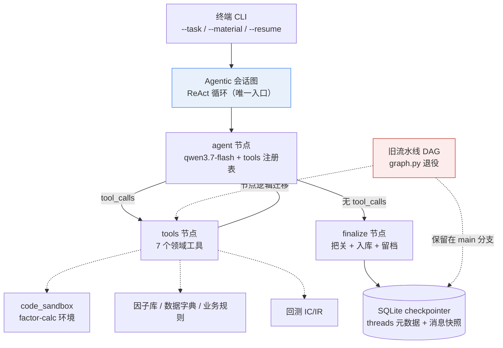
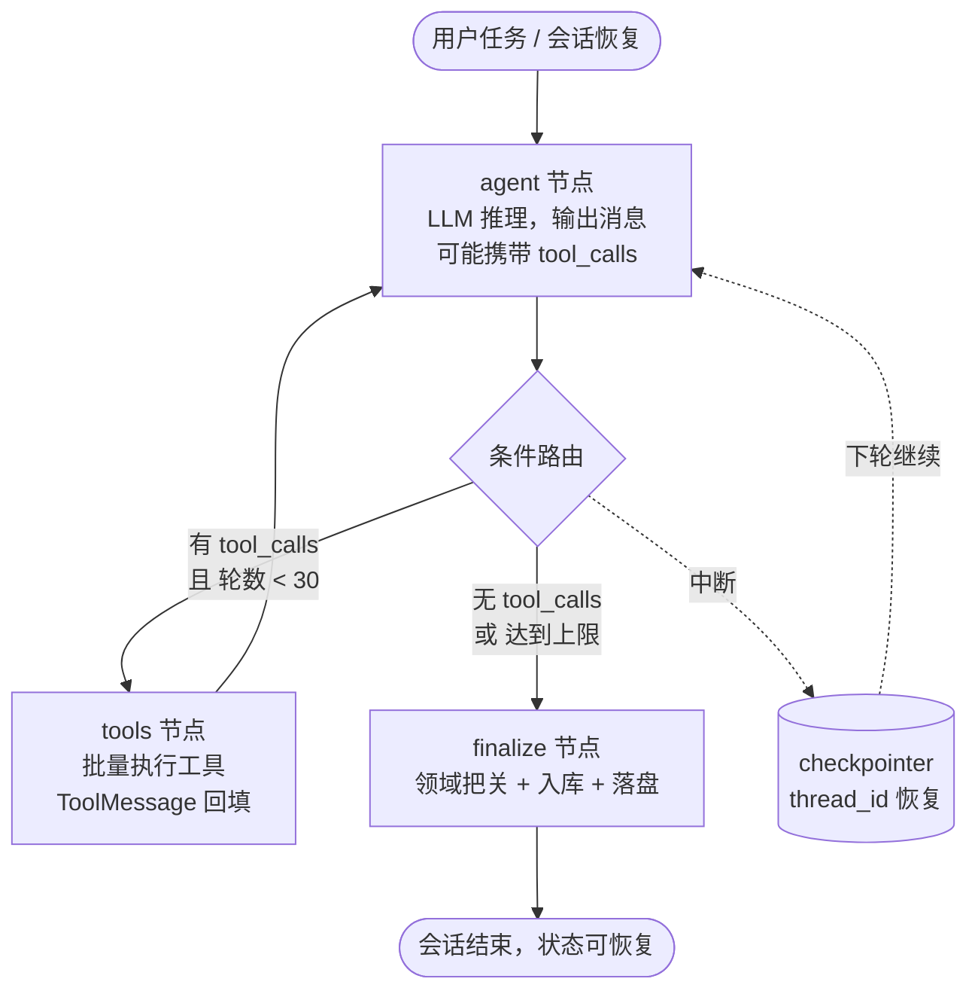

# Factor Miner Agent・Claude Code 式长程会话改造规划

> 版本：v0.2（决策已确认，进入实施准备）
> 创建日期：2026-09-15・更新日期：2026-09-15
> 目标分支：
>
> `feat/claude-code-like-agent`
>
> （本文档所在分支）
> 配套文档：
>
> [技术设计文档](./single_factor_miner_agent_design.md)
>
>  · 
>
> [开发进度看板](./progress/README.md)
> 框架：LangGraph（StateGraph 手写 ReAct）+ OpenAI Chat Completions 兼容接口（tool_calls）


***

## 0. 结论先行


* **核心判断**：当前智能体是 "确定性流水线"（每个节点做一件固定的事），Claude Code 是 "自主 ReAct 循环"（模型自己决定调什么工具、调几次、何时停）。二者本质不同，改造不是修修补补，而是**用自主智能体会话层直接替换流水线 DAG**。

* **已确认决策**（2026-09-15）：


| #  | 决策点   | 结论                                                          |
| -- | ----- | ----------------------------------------------------------- |
| Q1 | 模式策略  | **直接替换**：Agentic 会话模式成为唯一入口，流水线 DAG 退役                      |
| Q2 | 交互形态  | **批处理 CLI**：`--task` + `--resume` 会话恢复；交互式 REPL 留作 v2       |
| Q3 | 模型    | **qwen3.7-flash**（先做工具调用冒烟测试验证 function calling，不支持则换）      |
| Q4 | 工具集   | **首批 7 个现有能力工具**，不引入通用 python/shell 执行（安全边界不扩大，通用执行 v2 再评估） |
| Q5 | 人工介入  | **全自动**（工具直接执行）；`human_in_the_loop` 做成配置开关，默认关闭，后续按需开启      |
| Q6 | 长会话规模 | **上限 30 轮 /token 预算 = 模型窗口 60%**；上下文压缩（MA8）本期做基础版           |


* **实现路径**：手写 `StateGraph`（不用 `create_react_agent` 高层封装），精确控制消息结构、复用现有 SQLite checkpointer、叠加因子挖掘领域约束（PIT 校验、工具输出校验）。

* **排期**：6 个自然周（W38–W43，2026-09-14 \~ 2026-10-25），已避开中秋 / 国庆假期窗口，详见 §5。

* **回退保险**：`main` 分支保留完整旧实现（提交 `6b63124`），改造期间可随时 `git checkout main` 回退；实施顺序保证 "Agentic 先跑通并对照旧流水线结果一致，再移除流水线入口"。


***

## 1. 背景与目标

### 1.1 现状一句话

`factor_miner` 已是一个跑通的 LangGraph 流水线智能体：研报 → 候选抽取 → 粗筛 → 每候选子图（细筛 / 迭代 / 生成代码 / 沙箱执行 / 修复 / 相关性 / 回测）→ 入库留档，带 SQLite 断点续跑。**这些节点逻辑不会丢弃**，而是被迁移为 Agent 的工具底层实现与领域约束（§3.1 映射表）。

### 1.2 改造目标

对齐 Claude Code 的四项核心能力，全部落到本项目的量化因子挖掘场景：


| # | 能力                  | 含义                                                    |
| - | ------------------- | ----------------------------------------------------- |
| 1 | **自主工具调用循环（ReAct）** | 模型自主决定调用哪个工具、连续调用多少轮、何时结束，而不是走固定节点序列                  |
| 2 | **长程会话管理**          | 一次会话可跨越大量工具轮次与用户追问；中断可恢复；多会话并存可切换                     |
| 3 | **流式输出**            | 每一步 "思考 → 工具调用 → 工具返回" 实时可见，用户像看 Claude Code 一样观察执行过程 |
| 4 | **安全终止保护**          | 最大轮数、工具输出截断、沙箱隔离、超时兜底，杜绝死循环与上下文撑爆                     |

### 1.3 非目标（Scope Out）


* 不做 Web / 桌面 GUI（本期只做终端批处理 CLI）。

* 不做交互式 REPL（v2）。

* 不做多智能体协作（本期单智能体 + 工具，多 Agent 留作后续）。

* 不引入通用代码执行 /shell（安全边界不扩大）。

* 流水线 DAG 入口退役，但**其节点逻辑迁移复用**，不白扔已验收的领域能力。


***

## 2. 现状与差距分析

### 2.1 当前架构快照（代码级核实）


| 模块      | 文件                                    | 现状                                                                                                                  |
| ------- | ------------------------------------- | ------------------------------------------------------------------------------------------------------------------- |
| 主图      | `src/graph.py`                        | `StateGraph(MinerState)`：Ingest → Extract → Coarse → `Send()` 扇出 PerCandidate 子图                                    |
| 子图      | `src/graph.py`                        | FineFilter → Iterate → GenerateFactor → CodeExec → CodeFix → RelevanceCheck → Backtest → Save，条件边路由                 |
| 状态      | `src/state.py`                        | `MinerState` + `PerCandidateState`，**无消息栈字段**                                                                       |
| LLM 客户端 | `src/llm.py`                          | `chat_messages()` **已支持传入&#x20;**`tools`**&#x20;参数，但只返回&#x20;**`content`**&#x20;字符串，**`tool_calls`**&#x20;被丢弃**；无流式 |
| 沙箱      | `src/tools/code_sandbox.py`           | `run_factor_code()`：AST 校验（禁 import / 文件读 / 未来函数）+ subprocess 跑 `factor-calc` conda 环境，超时兜底                         |
| 领域工具    | `src/tools/`                          | `factor_library.py`（因子库）、`data_schema.py`（数据字典）、`business_rule.py`（业务规则），均为 Python 类而非 Agent 工具                     |
| 持久化     | `src/persistence.py` + `src/graph.py` | SQLite checkpointer（`SqliteSaver` + `NumpySafeSerializer`），`main.py --resume <run_id>` 已可用                          |
| 配置      | `configs/default.yaml`                | 模型 `qwen3.7-flash-2026-07-15`（DashScope MaaS，OpenAI 兼容）                                                             |
| 入口      | `src/main.py`                         | `--material / --resume / --run-id / --config`，单次流水线执行                                                               |

### 2.2 能力差距矩阵


| 维度   | Claude Code 式目标          | 当前实现                                         | 差距 / 改造量                     |
| ---- | ------------------------ | -------------------------------------------- | ---------------------------- |
| 执行模型 | 模型自主 ReAct 循环            | 固定 DAG 节点序列，LLM 只做单点任务                       | **大**：新增 agent/tools 循环      |
| 工具调用 | 任意轮次 tool\_calls         | 无（`chat_messages` 丢弃 tool\_calls）            | **大**：LLM 客户端扩展 + 工具注册表      |
| 消息栈  | user/assistant/tool 完整历史 | 仅 CodeFix 内部构造多轮 messages，不进图状态              | **大**：State 增加消息栈            |
| 会话管理 | thread\_id 多会话、中断恢复      | 有 checkpointer，但 thread\_id = run\_id，无会话元数据 | **中**：会话化封装                  |
| 流式   | 边执行边看                    | 无（同步 invoke，只有日志）                            | **中**：LLM SSE + graph.stream |
| 终止保护 | 轮数 / 截断 / 超时             | 仅有 CodeFix 10 轮、沙箱 60s                       | **中**：全局轮数与截断                |
| 领域工具 | 因子库 / 字典 / 规则 / 沙箱可自主调用  | 工具被硬编码进各节点                                   | **中**：改造成 Agent 工具           |
| 长上下文 | 摘要压缩                     | 无                                            | **小（v2）**：压缩节点               |

### 2.3 可直接复用资产（改造红利）


* ✅ SQLite checkpointer + 自定义 serializer（会话恢复的地基，无需重写）

* ✅ `code_sandbox.run_factor_code`（成熟的因子代码执行 + PIT 静态检查，直接注册为工具）

* ✅ `FactorLibrary` / `DataSchema` / `BusinessRules`（查询逻辑现成，包一层 tool schema 即可）

* ✅ 回测 / 相关性 / 入库逻辑（`backtest.py`、`relevance_check.py`、`persistence.py`）

* ✅ `configs/default.yaml` 配置体系与 LLM 重试（tenacity）

### 2.4 必须新造的部分


1. `LLMClient` 扩展：返回完整 message（含 `tool_calls`）+ 流式接口

2. 会话状态定义与消息模型（`AgentSessionState`）

3. 工具注册表（schema + 执行函数 + 输出校验）

4. ReAct 主循环图（agent /tools/ 条件路由 /finalize）

5. 会话持久化元数据（threads 表：任务、状态、摘要、恢复点）

6. CLI 批处理入口（`--task` / `--material` / `--resume` / `--list-sessions`）

7. 终止保护与上下文压缩节点


***

## 3. 目标架构设计

### 3.1 总体架构（直接替换）




**旧流水线节点职责 → 新 Agent 工具 / 职责映射**（"直接替换" 的落地路径，每一条都有承接）：


| 旧流水线节点                       | 新 Agentic 模式中的承接                                                                                    | 说明                             |
| ---------------------------- | --------------------------------------------------------------------------------------------------- | ------------------------------ |
| Ingest                       | `read_material` 工具                                                                                  | 解析 PDF/JSON → 分页文本             |
| ExtractCandidates            | agent 推理（无专用工具）                                                                                     | 模型从材料文本直接切分候选，能力已内化            |
| CoarseJudge / FineFilter（三关） | agent 自主调用 `query_factor_library` / `query_data_schema` / `query_business_rules` 自查 + finalize 兜底把关 | 把关逻辑下沉为 finalize 的领域校验（复用现有阈值） |
| Iterate                      | ReAct 循环天然覆盖                                                                                        | 模型收到负面反馈后自主改写，不再有固定轮数节点        |
| GenerateFactor / CodeFix     | agent 生成代码 + `run_factor_code` 工具迭代                                                                 | CodeFix 多轮修复逻辑被 ReAct 循环取代，更灵活 |
| RelevanceCheck / Backtest    | `run_backtest` 工具                                                                                   | 复用现有 IC/IR 计算与入库阈值             |
| SaveFactor / RunRecord       | `save_factor` 工具 + finalize 留档                                                                      | 复用 `persistence.py`            |

### 3.2 ReAct 核心循环（手写 StateGraph）

与 Claude Code 的 `User → Assistant(tool_calls) → Tool → ToolResult → Assistant(…/结束)` 一一对应：




伪代码（与用户参考一致，落地到本项目）:


```
class AgentSessionState(TypedDict, total=False):

&#x20;   thread\_id: str

&#x20;   task: str                              # 用户本轮任务

&#x20;   material\_path: str | None              # 可选输入

&#x20;   messages: Annotated\[list\[dict], operator.add]   # OpenAI 格式消息栈

&#x20;   agent\_rounds: int                      # 已执行轮数（终止保护，上限 30）

&#x20;   tool\_calls\_count: int

&#x20;   candidates: list\[CandidateRecord]      # 因子挖掘产出

&#x20;   errors: Annotated\[list\[str], operator.add]

def agent\_node(state):

&#x20;   resp = llm.chat\_messages(state\["messages"], tools=TOOL\_SCHEMAS)  # 扩展后返回完整 message

&#x20;   return {"messages": \[resp.as\_dict()], "agent\_rounds": state.get("agent\_rounds", 0) + 1}

def tools\_node(state):

&#x20;   last = state\["messages"]\[-1]

&#x20;   results = \[]

&#x20;   for call in last.get("tool\_calls", \[]):

&#x20;       try:

&#x20;           out = TOOL\_REGISTRY\[call\["name"]]\["fn"]\(\*\*call\["arguments"])

&#x20;       except Exception as e:

&#x20;           out = {"error": str(e)}

&#x20;       results.append({

&#x20;           "role": "tool", "tool\_call\_id": call\["id"],   # 必须原样回传，否则模型报错

&#x20;           "content": json.dumps(out, ensure\_ascii=False)\[:TOOL\_OUTPUT\_TRUNCATE],

&#x20;       })

&#x20;   return {"messages": results, "tool\_calls\_count": len(results)}

def route\_after\_agent(state):

&#x20;   last = state\["messages"]\[-1]

&#x20;   if state.get("agent\_rounds", 0) >= cfg.max\_agent\_rounds: return "finalize"

&#x20;   if last.get("tool\_calls"): return "tools"

&#x20;   return "finalize"

builder = StateGraph(AgentSessionState)

builder.add\_node("agent", agent\_node)

builder.add\_node("tools", tools\_node)

builder.add\_node("finalize", finalize\_node)

builder.set\_entry\_point("agent")

builder.add\_conditional\_edges("agent", route\_after\_agent,

&#x20;   {"tools": "tools", "finalize": "finalize"})

builder.add\_edge("tools", "agent")

builder.add\_edge("finalize", END)

graph = builder.compile(checkpointer=checkpointer)
```

### 3.3 状态与消息模型设计


* **消息格式**：沿用 OpenAI Chat Completions 原生 dict（`role/content/tool_calls/tool_call_id`），与现有 `LLMClient` 及 qwen 兼容接口零转换成本，避免引入 langchain 消息模型带来的依赖膨胀。

* **状态字段**：`AgentSessionState`（见上），`messages` 用 `operator.add` 归约以支持节点增量返回。

* **与旧状态的关系**：`MinerState` / `PerCandidateState` 不再作为图状态使用；其领域校验逻辑（阈值、PIT 规则）下沉到 finalize 与工具内部。

### 3.4 工具集设计（首批 7 个，全部来自现有已验收逻辑）

将现有能力封装为 OpenAI tools 格式（`name` + `description` + `parameters` JSON Schema），注册表驱动：


| 工具名                    | 对应现有实现                         | 用途                     | 输出             |
| ---------------------- | ------------------------------ | ---------------------- | -------------- |
| `run_factor_code`      | `code_sandbox.run_factor_code` | 提交因子代码，沙箱跑出因子值 parquet | 成功 / 失败 + 截断报错 |
| `query_factor_library` | `FactorLibrary`                | 查因子库描述 / 公式，做新颖性自查     | 匹配条目 + 相关性提示   |
| `query_data_schema`    | `DataSchema.summary_for_llm`   | 查可用字段、频率、口径            | 字段清单           |
| `query_business_rules` | `BusinessRules`                | 查业务合规规则                | 规则条目           |
| `run_backtest`         | `backtest_node` 逻辑             | 对已产出的因子值跑 IC/IR        | IC/IR/ 换手等指标   |
| `save_factor`          | `persistence.RunRecorder`      | 因子入库留档                 | 入库确认           |
| `read_material`        | `ingest_node` 逻辑               | 读取研报 / 论文 / 纪要文本       | 分页文本（截断）       |

> 通用代码执行 /shell（像 Claude Code 那样跑任意命令）明确
>
> **不在本期范围**
>
> （Q4 已确认），v2 再评估独立安全边界（如 E2B / 容器）。

### 3.5 会话管理


* **checkpointer 复用**：`SqliteSaver` 已具备；Agentic 模式下 `thread_id` 即会话 ID，`graph.invoke(..., config={"configurable": {"thread_id": sid}})` 天然支持中断恢复。

* **会话元数据**（新增 `threads` 表或 `threads.json`）：`thread_id`、任务摘要、创建 / 更新时间、状态（active/done）、最后 N 轮摘要。

* **CLI 交互**（批处理）：


  * `python -m src.main --task "从研报X提炼2个因子" [--material path] [--resume <sid>]`

  * `--list-sessions` 列出历史会话，`--resume` 从任意会话恢复，续聊不重建上下文。

* **多会话隔离**：不同 `thread_id` 的 checkpointer 命名空间天然隔离，互不串扰。

### 3.6 流式输出


* `LLMClient.chat_stream()`：基于 `client.chat.completions.create(stream=True)` 逐 chunk 产出 content 与 tool\_calls 增量。

* 图侧 `graph.stream(initial, config, stream_mode="updates")`：按节点粒度输出，终端实时打印 `[agent] 思考… → [tools] run_factor_code → [agent] 继续…`，与 Claude Code 的逐条过程展示对齐。

### 3.7 安全与终止保护


| 保护项                          | 默认值                                     | 说明                                   |
| ---------------------------- | --------------------------------------- | ------------------------------------ |
| `max_agent_rounds`           | 30                                      | 超限强制走 finalize，防 LLM 死循环（Q6 已确认）     |
| `tool_output_truncate_chars` | 8000                                    | 单条工具结果截断，防上下文撑爆                      |
| `messages_max_tokens`        | 模型窗口 60%（Q6 已确认）                        | 触发上下文压缩（§3.8）                        |
| 沙箱超时                         | 复用 `sandbox_timeout_sec=60`             | 代码执行兜底                               |
| `tool_call_id` 回传            | 强制原样                                    | 不匹配会导致 qwen 兼容接口报错                   |
| 工具异常                         | try/except 包裹                           | 失败以 `{"error": ...}` 返回给模型继续决策，不中断会话 |
| 人工介入                         | 配置开关 `human_in_the_loop: false`（Q5 已确认） | 默认全自动；后续可对 `save_factor` 等高风险工具开启确认  |

### 3.8 长上下文管理（v2 基础版，排期 W42）


* `compress` 节点：当消息栈 token 超预算（窗口 60%）时，把前 N-2 轮交给 LLM 生成结构化摘要，替换为一条 `system` 摘要消息，保留最近 2 轮原始细节。

* 会话元数据中的 "摘要" 字段与压缩节点共用同一套摘要格式。

* 落地依赖 `messages_max_tokens` 监控（在 `tools_node` 后检查 usage）。


***

## 4. 分阶段改造方案（模块清单）

> 编号沿用进度看板习惯（MA1…），每个模块含改动文件与验收标准。


| ID   | 模块         | 核心内容                                                                                         | 改动文件                                            | 验收标准                                                                    |
| ---- | ---------- | -------------------------------------------------------------------------------------------- | ----------------------------------------------- | ----------------------------------------------------------------------- |
| MA1  | LLM 客户端扩展  | `chat_messages` 返回完整 message（含 `tool_calls`）；新增 `chat_stream` 流式；**工具调用冒烟测试（qwen3.7-flash）** | `src/llm.py`                                    | 单测：mock 响应含 tool\_calls 时正确透传 id/args；真实调用 qwen 返回 tool\_calls；流式接口产出增量 |
| MA2  | 会话状态与消息模型  | `AgentSessionState`；消息 dict 工具函数（构造 / 校验 / 截断）                                               | `src/agent_state.py`（新）                         | 单测：messages 归约、tool 消息校验                                                |
| MA3  | 工具注册表      | 7 个工具 schema + 执行函数适配；统一输出截断与异常包装                                                            | `src/agent_tools/`（新）                           | 每个工具手动调用通过；schema 与 OpenAI tools 格式校验通过                                 |
| MA4  | ReAct 主循环图 | `agent/tools/finalize` 节点 + 条件路由 + 轮数保护；接入 checkpointer                                      | `src/agent_graph.py`（新）                         | 端到端：`invoke` 一次含 ≥2 轮工具调用的任务跑通；无 tool\_calls 时正常收尾                      |
| MA5  | 会话持久化      | `threads` 元数据读写；`--list-sessions` / `--resume <sid>` 恢复验证                                    | `src/persistence.py`、`src/main.py`              | 中断后 `--resume` 能从断点续跑且上下文完整                                             |
| MA6  | CLI 批处理入口  | `--task`/`--material`/`--resume`/`--list-sessions`；流式终端输出                                    | `src/main.py`                                   | 终端实时看到 agent→tools→agent 过程；一条任务跑通                                      |
| MA7  | 安全保护       | 轮数上限、输出截断、token 预算落地与配置化                                                                     | `src/agent_graph.py`、`configs/default.yaml`     | 构造无限循环用例被 30 轮上限截停；超长工具输出被截断                                            |
| MA8  | 上下文压缩      | 摘要生成与替换节点（基础版）                                                                               | `src/agent_graph.py`（新节点）                       | 长会话（≥20 轮）token 不超预算，恢复后结论一致                                            |
| MA9  | 流水线迁移与退役   | 旧节点逻辑迁移为工具 / 约束；`graph.py` 流水线入口冻结；对照旧结果回归                                                   | `src/graph.py`、`src/agent_tools/`、`src/main.py` | 同一研报在 Agentic 模式产出与旧流水线一致（或偏差有解释）；流水线入口移除后 `main` 分支可回退                 |
| MA10 | 测试与验收      | 单测 / 集成用例；README 与设计文档更新；进度看板登记                                                              | `tests/`、`docs/`、`README.md`                    | `pytest` 全绿；一条真实研报走通 agentic 模式出因子                                      |


***

## 5. 排期（自然周粒度，含节假日校准）

> 基准：2026-09-15（周二）。自然周定义：周一开始。
> 节假日假设：中秋 2026-09-25（周五）前后、国庆 10/1 起长假窗口（
>
> **以国务院 2026 年放假通知为准**
>
> ，若与实际不符顺延，排期已预留 W40 假期缓冲）。


| 自然周 | 日期范围           | 节假日影响                             | 里程碑       | 关键交付                                            |
| --- | -------------- | --------------------------------- | --------- | ----------------------------------------------- |
| W38 | 09-14 \~ 09-20 | 无                                 | MA1 + MA2 | LLM tool\_calls 透传 + 流式接口跑通（含 qwen 冒烟）；会话状态定义冻结 |
| W39 | 09-21 \~ 09-27 | 09-25 中秋（预计）                      | MA3 + MA4 | 工具注册表完成；ReAct 主循环可跑 ≥2 轮工具调用                    |
| W40 | 09-28 \~ 10-04 | 10-01 起国庆长假（预计 10/1–10/7，10/8 复工） | MA5       | 会话持久化 + `--resume` 恢复；假期前完成设计冻结                 |
| W41 | 10-05 \~ 10-11 | 10-08 复工                          | MA6 + MA7 | CLI 批处理 + 流式终端；安全保护全部落地                         |
| W42 | 10-12 \~ 10-18 | 无                                 | MA8 + MA9 | 上下文压缩；流水线迁移与退役，对照回归                             |
| W43 | 10-19 \~ 10-25 | 无                                 | MA10      | 全量测试、文档、演示验收                                    |

**节奏说明**：


* W38–W39 是核心攻坚（图 + 工具 + LLM 扩展），占总工作量约 60%；

* W40 遇国庆，设计 / 文档 / 单测类轻量任务前移，代码合并延后到 10/8 后；

* 每周五做一次可运行 demo（哪怕只跑通一个工具调用），避免 "最后一周大爆炸"。


***

## 6. 风险与对策


| 风险                                     | 影响     | 对策                                                                  |
| -------------------------------------- | ------ | ------------------------------------------------------------------- |
| qwen3.7-flash 不支持 / 不稳定支持 `tool_calls` | 循环跑不起来 | **MA1 首日先做工具调用冒烟测试**；不支持则换支持 function calling 的模型（换模型只影响 MA1，不影响架构） |
| tool\_call\_id 不匹配导致接口报错               | 偶发失败   | 严格原样回传；单测覆盖                                                         |
| LLM 无限循环调用工具                           | 资源耗尽   | 30 轮上限 + 每轮日志；构造死循环测试用例（MA7）                                        |
| 工具输出过大撑爆上下文                            | 质量退化   | 8000 字符截断 + token 预算监控（MA7/MA8）                                     |
| 直接替换后产出质量不达旧流水线                        | 结果不可控  | finalize 复用同一套筛选 / 回测 / 入库标准；MA9 做 "同材料对照回归"，偏差有解释才收尾               |
| 长假打断节奏                                 | 进度漂移   | W40 轻任务前移、重任务顺延，周末缓冲                                                |
| Agentic 自主性引入不确定性                      | 可复现性下降 | 会话元数据完整留档（threads + messages 快照）；`--resume` 可复现任意会话                 |


***

## 7. 决策记录（已确认，2026-09-15）


| #  | 决策点   | 结论                      | 备注                                 |
| -- | ----- | ----------------------- | ---------------------------------- |
| Q1 | 模式策略  | **直接替换**                | Agentic 为唯一入口；旧流水线保留在 `main` 分支可回退 |
| Q2 | 交互形态  | **批处理 CLI**             | `--task` + `--resume`；REPL 留作 v2   |
| Q3 | 模型    | **qwen3.7-flash**       | MA1 首日冒烟验证 function calling        |
| Q4 | 工具集   | **首批 7 个现有能力工具**        | 无通用 python/shell 执行；通用执行 v2 再评估    |
| Q5 | 人工介入  | **全自动**（开关默认关闭）         | `human_in_the_loop: false`，后续按需开启  |
| Q6 | 长会话规模 | **30 轮 / 窗口 60% token** | 上下文压缩本期做基础版                        |

> 若 Q4–Q6 推荐与实际预期不符，随时提出调整，仅影响对应模块范围，不影响 W38 的 MA1/MA2。


***

## 8. 参考


* 用户提供的 LangGraph ReAct 架构参考（`create_react_agent` 与手写 `StateGraph` 两种路径、工程坑清单）

* Claude Code：ReAct 循环 + 多轮工具调用 + 代码沙盒 + 自主终止 + 会话持久化

* 本项目现有实现：`src/graph.py`、`src/state.py`、`src/llm.py`、`src/tools/code_sandbox.py`、`src/main.py`、`configs/default.yaml`

* [技术设计文档](./single_factor_miner_agent_design.md)


***

## 附：本规划文档自身的管理


* 本文档随实施迭代；每完成一个 MA 模块，回到本文档更新状态并在 `docs/progress/README.md` 登记。

* 实施阶段从 MA1 开始，W38 内完成 MA1 + MA2 并提交。