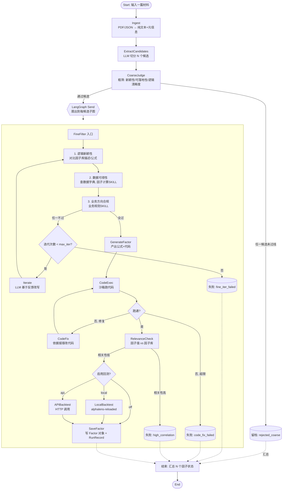

# 单因子挖掘智能体 · 技术设计文档

> 版本：v0.1（初稿，待开发过程中迭代）
> 创建日期：2026-09-14
> 框架：LangGraph + OpenAI Chat Completion 兼容接口
> 输入：单篇研报(PDF) / 论文(PDF) / 路演纪要(JSON)
> 输出：N 个成品因子（公式 + 可执行代码 + 因子值），及全流程留档 JSON

---

## 1. 概述

### 1.1 目标

给定一篇关于量化投资的非结构化材料（研报 / 论文 / 路演纪要），智能体自动完成：

1. 从材料中切分出 N 个候选因子（动机 + 描述 + 公式雏形）；
2. 通过多轮 LLM 评判（粗筛 / 细筛）筛掉低价值、不可落地、违反业务规则、与现有因子库重复的候选；
3. 对通过筛选的候选项，生成可执行的 Python 因子代码，自动修复直到能跑出因子值；
4. 对跑通的因子做因子值相关性复核与（可选）回测；
5. 全程留档，支持断点续跑。

### 1.2 设计原则

- **全自动跑完**，不做人机协同节点；
- **每个候选因子独立走子图**，粗筛 / 细筛 / 迭代 / 代码修复的次数互不影响；
- **所有阈值、模型、路径、开关都走 YAML 配置**，代码里不硬编码；
- **失败不静默**：任何一环失败都写入留档 JSON，标记失败原因，不进入下一环节；
- **PIT 合规前置**：所有生成的因子代码必须遵守 `skills/factor-calc` 的 Point-in-Time 规范（防未来函数、防生存偏差）。

### 1.3 术语

| 术语 | 含义 |
|---|---|
| 材料 / Material | 一次 run 输入的单篇文档（研报 / 论文 / 路演纪要） |
| 候选因子 / Candidate | 从材料中切分出的一个因子雏形（动机 + 描述 + 公式草稿） |
| 成品因子 / Factor | 通过全部筛选、代码可跑、（可选）完成回测的因子 |
| 因子库 / Factor Library | 本地已沉淀的因子集合，含每个因子的描述、公式、历史因子值矩阵 |
| 数据字典 / Data Schema | 本地 parquet 中所有字段的名称、含义、频率、来源、对齐方式 |
| Run | 一次完整执行（一篇材料 → 若干成品/废弃因子） |

---

## 2. 整体架构

### 2.1 流程图



### 2.2 主图 vs 子图

- **主图（Graph）**：Ingest → Extract → CoarseJudge → 用 `Send()` 把每个通过粗筛的候选分发到 **PerCandidateSubGraph** → 汇总。
- **子图（Subgraph）**：每个候选独立的细筛 / 迭代 / 代码生成 / 修复 / 相关性 / 回测。子图有自己独立的检查点（checkpoint），单候选失败不影响其他候选。

### 2.3 与已有 SKILL 的关系

| SKILL | 位置 | 作用 |
|---|---|---|
| `skills/factor-calc`（已存在） | GenerateFactor / CodeFix 节点的 system 约束 | 强制 PIT 合规：复权价、披露日对齐、`end_date = today-1`、禁止未来函数等。代码生成节点必须把 `references/rules-zh.md` 全文注入 system prompt。 |
| 业务规则 SKILL（待建，见 §9.2） | FineFilter 的业务方向检查子节点 | 承载"不做高频 T0 / 不做 ST / 不做上市不满一年"等业务黑名单。 |

---

## 3. 技术栈

### 3.1 双 conda 环境隔离

主程序和因子计算代码跑在两个独立 conda 环境，避免依赖冲突和安全隔离：

| 环境名 | 用途 | 关键依赖 |
|---|---|---|
| `factor-miner-agent` | LangGraph 编排、LLM 调用、文档解析 | langgraph, openai, pydantic, pdfplumber, loguru, pyyaml |
| `factor-calc` | 沙箱执行 LLM 生成的因子代码、读 parquet、回测 | pandas, numpy, pyarrow, alphalens-reloaded |

主环境通过 `subprocess` 调用 `~/miniconda3/envs/factor-calc/bin/python` 执行因子代码（配置项 `code_generation.python_bin`）。两者不共享 Python 进程，通过临时文件/stdout 交换数据。环境路径可在 `configs/default.yaml` 中修改。

```bash
# 创建两个环境
conda create -n factor-miner-agent python=3.11 -y
conda create -n factor-calc python=3.11 -y

# 主环境
conda activate factor-miner-agent
pip install -e .

# 因子环境
conda activate factor-calc
pip install pandas numpy pyarrow alphalens-reloaded
```

### 3.2 依赖清单

| 类别 | 选型 | 说明 |
|---|---|---|
| 编排 | `langgraph >= 0.2` | 主图 + 子图 + `Send` 扇出 + `Checkpointer` |
| LLM 客户端 | `openai >= 1.x` | 用 `base_url` 兼容 OpenAI Chat Completion 协议，可切任意厂商 |
| 数据模型 | `pydantic >= 2` | State / Factor / RunRecord 全部走 pydantic |
| 配置 | `pyyaml` | YAML 配置文件 |
| PDF 解析 | `pdfplumber`（或 `pypdf`） | 研报/论文 → 纯文本，保留页码用于引用定位 |
| 表格处理 | `pandas` + `pyarrow` | parquet 读写、因子值计算 |
| 向量/语义 | 暂不启用 | 因子库目前不大，新颖性直接 LLM 判；库变大后再加 embedding 粗排 |
| 本地回测 | `alphalens-reloaded`（可选） | `backtest.mode=local` 时启用 |
| 持久化 | `langgraph.checkpoint.sqlite` | SQLite checkpoint；生产可换 Postgres |
| 沙箱执行 | `subprocess` + 独立 venv | 代码修复阶段用隔离 Python 进程执行因子代码，超时/资源限制 |
| 日志 | `loguru` | 结构化日志，每节点入参/出参落盘 |
| 开发 | `ruff` / `mypy` / `pytest` | |

> **不依赖** `langchain` 上层抽象（Chain/AgentExecutor），直接用 `langgraph` 的 StateGraph + 原生 `openai` SDK，减少抽象泄漏。

---

## 4. 项目目录结构

```
factor_miner/
├── docs/
│   └── single_factor_miner_agent_design.md   # 本文档
├── configs/
│   ├── default.yaml                          # 全局默认配置
│   ├── data_schema.yaml                      # 数据字典（字段名/含义/频率/来源）
│   ├── factor_library_index.yaml             # 因子库索引（路径、描述、公式）
│   └── business_rules.yaml                   # 业务黑名单规则（待与业务对齐后填充）
├── skills/
│   ├── factor-calc/                          # 已存在：PIT 规范
│   └── business-rule-check/                  # 待建：业务方向规则 SKILL
│       ├── SKILL.md
│       └── references/rules.md
├── data/
│   ├── raw/                                  # 输入材料：研报.pdf / 论文.pdf / 路演.json
│   ├── parquet/                              # 本地行情/财务等 parquet
│   ├── factor_library/                       # 已有因子值 parquet + 因子元信息
│   └── runs/                                 # 每次 run 的产出（见 §10）
│       └── {run_id}/
│           ├── run_record.json               # 全流程留档
│           ├── checkpoints.db                # LangGraph SQLite checkpoint
│           ├── candidates/
│           │   └── {candidate_id}.json
│           ├── factors/
│           │   ├── {factor_id}.py            # 最终代码
│           │   ├── {factor_id}_values.parquet # 因子值矩阵
│           │   └── {factor_id}_report.html    # 回测报告（可选）
│           └── logs/
│               └── agent.log
├── src/
│   ├── __init__.py
│   ├── main.py                               # CLI 入口：python -m src.main --material xxx.pdf
│   ├── config.py                             # YAML 加载、校验、dataclass
│   ├── state.py                              # LangGraph State 定义（§6）
│   ├── models.py                            # pydantic 模型：Material/Candidate/Factor/RunRecord（§10）
│   ├── graph.py                             # 主图 + 子图构建
│   ├── llm.py                                # OpenAI 客户端封装、重试、JSON 模式
│   ├── prompts/                              # Prompt 模板骨架（§13）
│   │   ├── extract_candidates.j2
│   │   ├── coarse_judge.j2
│   │   ├── fine_checks.j2
│   │   ├── iterate.j2
│   │   ├── generate_factor.j2
│   │   └── code_fix.j2
│   ├── nodes/
│   │   ├── ingest.py
│   │   ├── extract_candidates.py
│   │   ├── coarse_judge.py
│   │   ├── fine_filter.py
│   │   ├── iterate.py
│   │   ├── generate_factor.py
│   │   ├── code_exec.py
│   │   ├── code_fix.py
│   │   ├── relevance_check.py
│   │   └── backtest.py
│   ├── tools/
│   │   ├── data_schema.py                    # 读 data_schema.yaml，提供字段查询
│   │   ├── factor_library.py                 # 读因子库元信息 + 因子值 parquet
│   │   ├── business_rule.py                  # 业务规则检查工具
│   │   ├── code_sandbox.py                   # 子进程沙箱执行 Python
│   │   └── semantic_sim.py                   # embedding 相似度（可选）
│   └── persistence.py                        # Checkpointer 初始化、RunRecord flush
├── tests/
│   ├── test_state.py
│   ├── test_data_schema.py
│   ├── test_code_sandbox.py
│   └── fixtures/
└── pyproject.toml
```

---

## 5. 全局配置（YAML）

`configs/default.yaml`：

```yaml
# ---------- LLM ----------
llm:
  provider: openai_compatible
  base_url: "https://api.openai.com/v1"
  api_key_env: "OPENAI_API_KEY"          # 从环境变量读，不写死
  model: "gpt-4o-mini"
  temperature: 0.2
  timeout_sec: 120
  max_retries: 3
  # 代码生成/修复节点可用更强模型（可选覆盖）
  overrides:
    generate_factor:
      model: "gpt-4o"
    code_fix:
      model: "gpt-4o"

# ---------- 输入材料 ----------
material:
  type: auto            # auto | pdf | json   (auto 按扩展名)
  # 一次跑一篇：CLI 传入文件路径即可

# ---------- 候选抽取 ----------
extraction:
  max_candidates_per_doc: 15     # LLM 抽不出这么多就少抽
  min_candidates_per_doc: 1
  require_fields: [motivation, logic_desc, formula_draft]

# ---------- 粗筛 ----------
coarse_judge:
  dimensions:
    - key: novelty
      name: "新颖性"
      desc: "该因子逻辑在当前材料内部及已有认知中是否新颖，1-5 分"
    - key: feasibility
      name: "可落地性"
      desc: "逻辑是否清晰、公式是否可计算，1-5 分"
    - key: logic_clarity
      name: "逻辑清晰度"
      desc: "动机与公式之间的因果链是否自洽，1-5 分"
  pass_threshold: 3.0           # TODO: 待首轮跑完后校准
  min_avg_score: 3.0
  fail_action: "mark_and_archive" # 不通过 → 留档，不进子图

# ---------- 细筛 ----------
fine_filter:
  max_iterations: 3              # 迭代优化最大轮数
  novelty_check:
    enabled: true
    # 因子库目前规模不大，直接把库中所有因子的 name/description/formula
    # 喂给 LLM，让 LLM 判断新候选是否与库中某因子"实质等价"。
    # 库变大后可加 embedding 粗排做预筛，这里先留 top_k 占位（0=全量喂）。
    top_k_for_llm: 0
    llm_judge_threshold: "equivalent"   # 等价 / 部分等价 / 不同
  data_availability:
    enabled: true
    data_schema_path: "configs/data_schema.yaml"
    allow_derived_fields: true   # 允许"用已有字段推导"
  business_rules:
    enabled: true
    rules_path: "configs/business_rules.yaml"

# ---------- 代码生成与执行 ----------
code_generation:
  max_fix_rounds: 10
  sandbox_timeout_sec: 60
  sandbox_memory_mb: 2048
  python_bin: "~/miniconda3/envs/factor-calc/bin/python"   # factor-calc conda 环境
  pct_rules_path: "skills/factor-calc/references/rules-zh.md"  # 注入 system prompt

# ---------- 因子值相关性 ----------
relevance:
  enabled: true
  corr_method: "spearman"       # 截面秩相关
  max_corr_to_library: 0.7      # 与库中任一因子 |corr| 超过此值即判重复
  lookback_days: 250            # 用最近 N 个交易日评估

# ---------- 回测 ----------
backtest:
  enabled: true
  mode: local                   # local | api | off
  local:
    backend: "alphalens-reloaded"
    universe: ["csi800"]        # 列表，可扩展为 ["csi800", "csi1000"]；回测时逐池分别跑
    start_date: "2019-01-01"
    end_date: "auto"            # today - 1
  api:
    mode: async                 # sync | async（后续按真实接口协议填）
    endpoint_submit: "http://localhost:8000/backtest"      # POST 提交任务（async 模式返回 task_id）
    endpoint_query: "http://localhost:8000/backtest/{task_id}"  # GET 轮询结果
    poll_interval_sec: 5
    timeout_sec: 600

# ---------- 持久化 ----------
persistence:
  run_root: "data/runs"
  checkpointer: "sqlite"
  flush_each_node: true         # 每个节点结束都 flush RunRecord

# ---------- 鲁棒性 ----------
robustness:
  llm_retry: 3
  llm_retry_backoff_sec: [2, 5, 10]
  json_repair: true             # LLM 输出 JSON 损坏时尝试修复
  step_timeout_sec: 600         # 单个节点最长执行时间
```

`configs/business_rules.yaml`（与业务讨论后填充）：

```yaml
rules:
  - id: no_high_freq_t0
    desc: "不做高频 T0 类因子（持仓周期 < 1 日）"
    match_keywords: ["T+0", "高频", "tick", "日内"]
  - id: no_st
    desc: "不做依赖 ST 股可交易的因子（股票池必须排除 ST）"
  - id: no_new_listing
    desc: "不做上市不满一年的股票（因子在信号日必须已上市 ≥ 252 个交易日）"
  # TODO: 与业务补充更多规则
```

---

## 6. 全局 State 定义

LangGraph State 同时承担：① 图内数据流转；② Checkpointer 序列化；③ 断点恢复。

```python
# src/state.py
from __future__ import annotations
from typing import TypedDict, Annotated, Literal
from pydantic import BaseModel, Field
from datetime import datetime
import operator

class MaterialMeta(BaseModel):
    run_id: str
    path: str
    type: Literal["pdf", "json"]
    title: str | None = None
    pages: int | None = None
    loaded_at: datetime

class CandidateRecord(BaseModel):
    """单个候选因子在全生命周期内的所有状态（同时是 RunRecord 的最小单元）"""
    candidate_id: str
    name: str
    motivation: str
    logic_desc: str
    formula_draft: str
    source_page: int | None = None       # PDF 页码 / JSON 节点路径
    source_excerpt: str | None = None    # 原文摘录（≤500字）

    # 粗筛
    coarse_scores: dict[str, float] = Field(default_factory=dict)   # {novelty: 4, ...}
    coarse_avg: float | None = None
    coarse_passed: bool | None = None
    coarse_judgement: str | None = None

    # 细筛
    fine_iteration: int = 0
    fine_checks: dict = Field(default_factory=dict)   # {novelty: {...}, data_avail: {...}, biz: {...}}
    fine_passed: bool | None = None
    fine_feedback: str | None = None

    # 代码
    formula_latex: str | None = None
    python_code: str | None = None
    required_fields: list[str] = Field(default_factory=list)
    code_fix_rounds: int = 0
    code_last_error: str | None = None
    code_runnable: bool | None = None

    # 因子值 & 相关性
    factor_values_path: str | None = None
    corr_to_library: float | None = None
    corr_passed: bool | None = None

    # 回测
    backtest_report_path: str | None = None
    ic: float | None = None
    ir: float | None = None

    # 终态
    status: Literal[
        "pending",
        "coarse_rejected",
        "fine_iter_failed",
        "code_fix_failed",
        "high_correlation",
        "code_runnable",
        "backtested",
    ] = "pending"
    final_error: str | None = None


class MinerState(TypedDict, total=False):
    # 输入
    material_path: str
    run_id: str

    # 阶段 1: Ingest
    material: MaterialMeta
    material_text: str           # 全文（可能很长，不入 LLM prompt，按需切片）

    # 阶段 2: Extract
    candidates: list[CandidateRecord]
    extract_raw: str             # LLM 原始输出（调试用）

    # 阶段 3: Coarse
    coarse_done: bool

    # 扇出后子图写入（主图汇总用）
    finished_candidates: Annotated[list[CandidateRecord], operator.add]

    # 运行控制
    errors: Annotated[list[str], operator.add]
    started_at: datetime
```

> **为什么用 `Annotated[list, operator.add]`**：子图并行写回主图时，LangGraph 会自动 append，不需要手动合并。

---

## 7. 各节点详细设计

### 7.1 Ingest 节点

**职责**：把材料读成统一的纯文本 + 元信息。

**输入**（State）：`material_path`
**输出**（State 增量）：`material: MaterialMeta`、`material_text: str`

**逻辑**：

```python
def ingest_node(state: MinerState) -> dict:
    path = state["material_path"]
    if path.endswith(".pdf"):
        text, pages = parse_pdf(path)        # pdfplumber，保留页码
        mtype = "pdf"
    elif path.endswith(".json"):
        text = flatten_roadshow_json(path)   # 路演 JSON → 纯文本（保留段落路径）
        pages = None
        mtype = "json"
    else:
        raise ValueError(f"unsupported material type: {path}")
    run_id = gen_run_id(path)
    return {
        "material": MaterialMeta(run_id=run_id, path=path, type=mtype, pages=pages, ...),
        "material_text": text,
        "run_id": run_id,
        "started_at": datetime.now(),
    }
```

**异常**：文件不存在、加密 PDF、JSON 解析失败 → 节点直接抛错，Checkpointer 记录，CLI 打印原因，不进入下一节点。

---

### 7.2 ExtractCandidates 节点

**职责**：LLM 从材料全文切分 N 个候选因子，每个候选包含：`name / motivation / logic_desc / formula_draft / source_page / source_excerpt`。

**输入**：`material_text`、`material`
**输出**：`candidates: list[CandidateRecord]`

**关键设计**：

- 材料可能很长（研报 30+ 页），**不一次性塞给 LLM**。按章节/页码切片，逐段抽取，最后合并去重；
- LLM 必须输出严格 JSON（见 §13.1 prompt）；
- 每条候选的 `source_excerpt` 是原文 ≤500 字片段，供后续节点溯源；
- `candidate_id` 规则：`{run_id}_c{idx:02d}`。

**伪代码**：

```python
def extract_candidates_node(state):
    chunks = split_by_pages(state["material_text"], max_chars=6000)
    raw_candidates = []
    for chunk in chunks:
        resp = llm.chat(
            model=cfg.llm.model,
            messages=[
                {"role": "system", "content": PROMPT_EXTRACT_SYSTEM},
                {"role": "user", "content": render_extract_user(chunk)},
            ],
            response_format={"type": "json_object"},
        )
        raw_candidates.extend(parse_llm_json(resp)["candidates"])
    deduped = dedup_by_name_and_logic(raw_candidates)[:cfg.extraction.max_candidates_per_doc]
    candidates = [CandidateRecord(**c, candidate_id=...) for c in deduped]
    return {"candidates": candidates}
```

---

### 7.3 CoarseJudge 节点

**职责**：对每个候选按 3 个维度打分（novelty / feasibility / logic_clarity），决定是否进入子图。

**输入**：`candidates`
**输出**：`candidates`（原地写入 `coarse_scores / coarse_avg / coarse_passed / coarse_judgement`）

**关键设计**：

- **不判断业务价值**（用户已确认：仅凭基本信息不足以判断，留到细筛）；
- 一批候选一次性交给 LLM 评分（减少调用次数），要求输出 `{candidate_id: {scores, judgement}}`；
- 通过规则：`avg >= pass_threshold` 且每维都 ≥ 一个底线（默认 2 分，可配置）；
- 未通过的候选在 State 中保留 `status="coarse_rejected"`，不进子图，但最终进入 RunRecord。

**伪代码**：

```python
def coarse_judge_node(state):
    payload = [{"candidate_id": c.candidate_id, "name": c.name,
                "motivation": c.motivation, "logic_desc": c.logic_desc,
                "formula_draft": c.formula_draft} for c in state["candidates"]]
    result = llm.chat_json(PROMPT_COARSE_SYSTEM, render_coarse_user(payload, cfg))
    for c in state["candidates"]:
        r = result[c.candidate_id]
        c.coarse_scores = r["scores"]
        c.coarse_avg = sum(r["scores"].values()) / len(r["scores"])
        c.coarse_judgement = r["judgement"]
        c.coarse_passed = (
            c.coarse_avg >= cfg.coarse_judge.pass_threshold
            and min(r["scores"].values()) >= 2.0
        )
        if not c.coarse_passed:
            c.status = "coarse_rejected"
    return {"candidates": state["candidates"], "coarse_done": True}
```

**路由**（主图条件边）：

```python
def route_after_coarse(state):
    passed = [c for c in state["candidates"] if c.coarse_passed]
    if not passed:
        return "aggregate"          # 全部淘汰，直接结束
    # 用 Send 扇出
    return [Send("per_candidate_subgraph", {"candidate": c, **shared_context})
            for c in passed]
```

---

### 7.4 Per-Candidate SubGraph（每候选子图）

子图输入：单个 `CandidateRecord` + 共享上下文（因子库元信息、数据字典、业务规则路径、配置）。

子图节点：FineFilter → Iterate（条件回边）→ GenerateFactor → CodeExec → CodeFix（条件回边）→ RelevanceCheck → Backtest → Save。

#### 7.4.1 FineFilter 节点

依次跑三个检查，任一失败即记录失败原因：

```python
def fine_filter_node(state):
    c: CandidateRecord = state["candidate"]
    checks = {}

    # 1. 逻辑新颖性：因子库目前不大，直接把库中因子的 name/description/formula
    #    全量（或 top-K）喂给 LLM，让 LLM 判断新候选是否与某个已有因子实质等价
    if cfg.fine_filter.novelty_check.enabled:
        checks["novelty"] = check_logic_novelty(c, factor_library_index, cfg)
        # 实现见 tools/factor_library.py：把库中因子描述拼成列表，让 LLM 输出
        # 是否等价、等价于哪个因子；若等价则 novelty 不通过

    # 2. 数据可得性：LLM 一步判断 + 代码兜底校验
    if cfg.fine_filter.data_availability.enabled:
        checks["data_avail"] = check_data_availability(c, data_schema, llm)
        # LLM 同时输出：fields_needed / fields_available / fields_missing / fatal
        # fatal=true：核心逻辑依赖整个大类数据（如行业、财务），字典里完全没有，
        #            换字段也实现不了 → 直接失败，不进 iterate
        # fatal=false：缺失可通过换字段/换口径绕过 → 进 iterate
        # schema.check() 做兜底：防止 LLM 撒谎说字段有但其实没有

    # 3. 业务方向：业务规则 SKILL
    if cfg.fine_filter.business_rules.enabled:
        checks["biz"] = check_business_rules(c, business_rules)

    c.fine_checks = checks
    c.fine_passed = all(ok for ok in [v.get("passed") for v in checks.values()])
    if not c.fine_passed:
        c.fine_feedback = build_feedback(checks)   # 汇总哪个检查失败、为什么
    return {"candidate": c}
```

**路由**：

```python
def route_after_fine(state):
    c = state["candidate"]
    if c.fine_passed:
        return "generate_factor"
    if c.fine_iteration >= cfg.fine_filter.max_iterations:
        c.status = "fine_iter_failed"
        return "save"     # 子图结束
    return "iterate"
```

#### 7.4.2 Iterate 节点

**职责**：LLM 根据 `fine_feedback` 修改候选的 `motivation / logic_desc / formula_draft`，绕过失败检查。

**输入**：`candidate`（含 `fine_feedback`）
**输出**：`candidate`（更新三个字段，`fine_iteration += 1`）

**Prompt 骨架**：把候选现状 + 三个检查的失败原因 + 因子库中相似因子（避免改完仍撞车）+ 数据字典摘要喂给 LLM，要求输出新的三元组。

**关键约束**：LLM 不得改变"因子核心思想"太远——它只能在原动机基础上换公式 / 换字段 / 换口径，不能换成另一个因子（在 prompt 里硬约束）。

#### 7.4.3 GenerateFactor 节点

**职责**：把通过细筛的候选扩展成正式的 `formula_latex + python_code + required_fields`。

**实现**：`src/nodes/generate_factor.py`，prompt 在 `src/prompts/generate_factor_system.txt`。

**输入**：`candidate`（含 motivation/logic_desc/formula_draft）
**输出**：`candidate.formula_latex / python_code / required_fields`

**实际实现**：

- 从 `skills/factor-calc/references/rules-zh.md` 读 PIT 规范全文，注入 system prompt 的 `{{PIT_RULES}}` 占位；
- User message 带候选的 name/motivation/logic_desc/formula_draft + 数据字典摘要；
- LLM 输出 JSON：`{formula_latex, python_code, required_fields}`；
- 节点用 `ast` 扫描代码中所有 `df["xxx"]` 和 `df.xxx`，补充 LLM 漏列的字段；
- 代码签名固定：`def compute(df: pd.DataFrame) -> pd.Series`，df 索引 `(date, code)`。

#### 7.4.4 CodeExec 节点（沙箱执行）

**职责**：在 `factor-calc` conda 环境里真跑因子代码，得到因子值 parquet。

**实现**：`src/tools/code_sandbox.py` + `src/nodes/code_exec.py`。

**输入**：`candidate.python_code / required_fields`
**输出**：`candidate.code_runnable / factor_values_path / code_last_error / code_fix_history`

**实际实现**：

1. 写临时脚本：用户代码 + 读 `data/parquet/market.parquet` + 调 `compute(df)` + 写结果 parquet；
2. `subprocess.run([cfg.code_generation.python_bin, script.py])`，超时 60s；
3. 成功 → 因子值写到 `data/runs/{run_id}/factors/{candidate_id}_values.parquet`；
4. 失败 → stderr 截断 3000 字符存 `code_last_error`，`code_fix_rounds += 1`；
5. **每次执行都追加 `code_fix_history`**：`{round, python_code, success, error, timestamp}`。

**路由**：

```python
def route_after_code_exec(state):
    c = state["candidate"]
    if c.code_runnable:
        c.status = "code_runnable"
        return "save"   # M4: relevance_check
    if c.code_fix_rounds >= cfg.code_generation.max_fix_rounds:
        c.status = "code_fix_failed"
        return "save"
    return "code_fix"
```

#### 7.4.5 CodeFix 节点

**职责**：把上一次的报错 traceback 喂给 LLM，让它改代码。

**实现**：`src/nodes/code_fix.py`，prompt 在 `src/prompts/code_fix_system.txt`。

**输入**：`candidate.python_code / code_last_error / required_fields`
**输出**：`candidate.python_code`（新版本），补充 `required_fields`

**实际实现**：

- System prompt 同样注入 PIT 规范（`{{PIT_RULES}}`）；
- User message 带：完整 traceback、原代码、数据字典摘要；
- LLM 输出 JSON：`{python_code, required_fields}`；
- 最多 `max_fix_rounds`（默认 10）轮，每轮的代码和结果都记在 `code_fix_history`。

#### 7.4.6 RelevanceCheck 节点

**职责**：把新算出的因子值与因子库中所有因子值做截面相关性。

**输入**：`candidate.factor_values_path`
**输出**：`candidate.corr_to_library / corr_passed`

**实现**：

```python
def check_relevance(values: pd.Series, library_dir: str) -> float:
    # 每个截面日（date）：
    #   - 对新因子排名，对库中每个因子排名；
    #   - 计算 spearman 相关；
    #   - 取全样本平均 |corr|；
    # 与库中所有因子的最大 |corr| 即 corr_to_library。
```

**路由**：`corr_to_library <= max_corr_to_library` → 回测；否则 `status="high_correlation"` → save。

#### 7.4.7 Backtest 节点（模块化）

**职责**：按配置选择本地或 API 回测。

**接口**：

```python
class Backtester(Protocol):
    def run(self, factor_values_path: str, universe: str,
            start: str, end: str) -> BacktestResult: ...

class LocalAlphalensBacktester: ...   # backtest.mode=local
class APIBacktester: ...              # backtest.mode=api

def get_backtester(cfg) -> Backtester:
    if cfg.backtest.mode == "local":
        return LocalAlphalensBacktester(cfg)
    if cfg.backtest.mode == "api":
        return APIBacktester(cfg)
    return NullBacktester()
```

**输出**：`ic / ir / backtest_report_path`（HTML 或 JSON）。

#### 7.4.8 Save 节点

**职责**：把 `candidate` 序列化到 `data/runs/{run_id}/candidates/{candidate_id}.json`；若 `status in ("code_runnable","backtested")`，同时把代码写入 `factors/{factor_id}.py`，因子值 parquet 路径登记。

---

## 8. 边路由汇总

| 起点 | 条件 | 终点 |
|---|---|---|
| ingest | 无条件 | extract_candidates |
| extract_candidates | 无条件 | coarse_judge |
| coarse_judge | 有候选通过 | Send → per_candidate_subgraph |
| coarse_judge | 全不通过 | aggregate |
| fine_filter | 通过 | generate_factor |
| fine_filter | 未通过 且 iter<max | iterate |
| fine_filter | 未通过 且 iter≥max | save（子图结束） |
| iterate | 无条件 | fine_filter |
| generate_factor | 无条件 | code_exec |
| code_exec | 成功 | relevance_check |
| code_exec | 失败 且 fix<max | code_fix |
| code_exec | 失败 且 fix≥max | save |
| code_fix | 无条件 | code_exec |
| relevance_check | 通过 | backtest |
| relevance_check | 高相关 | save |
| backtest | 无条件 | save |
| 所有子图结束 | 主图聚合 | flush_run_record → end |

---

## 9. SKILLS 设计

### 9.1 `factor-calc`（已存在）

- 位置：`skills/factor-calc/`
- 用法：**不是作为代码执行工具**，而是作为 **GenerateFactor / CodeFix 节点 system prompt 的一部分**。把 `references/rules-zh.md` 全文读入，拼进 system message，强制 LLM 生成的代码遵守 PIT 规范。
- 校验：CodeExec 沙箱跑完后，可在鲁棒性环节做静态扫描（如检查代码里是否出现 `.shift(0)` 当日成交、是否用了未来窗口），违规直接判 `code_runnable=False`，进入修复循环。

### 9.2 `business-rule-check`（待建）

- 位置：`skills/business-rule-check/`
- 文件：
  - `SKILL.md`：说明业务规则的判断方法论；
  - `references/rules.md`：从 `configs/business_rules.yaml` 渲染而来的人类可读版本，供 LLM 阅读。
- 工具接口（`tools/business_rule.py`）：

  ```python
  def check_business_rules(candidate: CandidateRecord,
                           rules: list[Rule]) -> BizCheckResult:
      # 1. 规则中带 match_keywords 的，直接在 logic_desc / formula_draft 中字符串匹配；
      # 2. 需要语义判断的规则（如"是否高频"），调用 LLM，把候选描述 + 规则清单喂入；
      # 3. 返回: {passed: bool, violated: [rule_id], reason: str}
  ```

### 9.3 数据可得性工具（`tools/data_schema.py`）

- 输入：`CandidateRecord`（含 `formula_draft / logic_desc`）；
- 过程：
  1. 让 LLM 从候选描述中抽出"所需数据字段清单"（如 `close, pe_ttm, float_share`）；
  2. 与 `configs/data_schema.yaml` 比对：
     - 字段直接命中 → OK；
     - 字段未命中 → 尝试从"可推导字段"列表中找（如 `ret_1d` 可由 `close` 推导）；
     - 仍找不到 → 失败，给出缺失字段清单；
  3. 返回 `{passed, missing_fields, derivable_fields, reason}`。

---

## 10. 核心数据模型与留档

### 10.1 RunRecord（全流程留档 JSON）

路径：`data/runs/{run_id}/run_record.json`

```json
{
  "run_id": "20260914_153000__research_001",
  "material": {
    "path": "data/raw/2026Q3_半导体研报.pdf",
    "type": "pdf",
    "title": "...",
    "pages": 28
  },
  "started_at": "2026-09-14T15:30:00",
  "finished_at": null,
  "config_snapshot": { "...": "本次 run 使用的关键配置快照，便于复现" },
  "candidates": [
    {
      "candidate_id": "20260914_153000__c01",
      "name": "北向资金净流入偏离度",
      "status": "backtested",
      "coarse_scores": {"novelty": 4, "feasibility": 4, "logic_clarity": 5},
      "fine_checks": {...},
      "fine_iteration": 1,
      "iteration_history": [
        {"iteration": 0, "motivation": "...", "formula_draft": "...", "passed": false, "fine_feedback": "[data_avail] 缺失字段: ..."},
        {"iteration": 1, "motivation": "...", "formula_draft": "...", "passed": true, "fine_feedback": null}
      ],
      "code_fix_rounds": 2,
      "code_fix_history": [
        {"round": 0, "python_code": "...", "success": false, "error": "KeyError: ..."},
        {"round": 1, "python_code": "...", "success": false, "error": "ValueError: ..."},
        {"round": 2, "python_code": "...", "success": true, "error": null}
      ],
      "corr_to_library": 0.32,
      "ic": 0.045,
      "ir": 1.2,
      "artifacts": {
        "code_path": "data/runs/.../factors/f01.py",
        "values_path": "data/runs/.../factors/f01_values.parquet",
        "report_path": "data/runs/.../factors/f01_report.html"
      },
      "error": null
    }
  ],
  "summary": {
    "total_extracted": 12,
    "coarse_passed": 5,
    "fine_passed": 3,
    "code_runnable": 3,
    "final_factors": 2,
    "rejected": {...}
  }
}
```

### 10.2 写入时机

- 每个节点执行完 → flush 该节点涉及的候选字段；
- 子图结束 → flush 该候选整段；
- 主图结束 → 写 `summary` 和 `finished_at`；
- 用 `flush_each_node: true` 保证断点续跑时最近一次状态不丢。

---

## 11. 持久化与断点续跑

### 11.1 双层持久化

| 层 | 技术 | 目的 |
|---|---|---|
| LangGraph Checkpointer | `SqliteSaver(data/runs/{run_id}/checkpoints.db)` | 图执行状态序列化，支持 `graph.invoke(..., config={"configurable": {"thread_id": run_id}})` 断点恢复 |
| RunRecord JSON | 自己写 | 人类可读、可审计、可离线分析；与 checkpoint 互补 |

### 11.2 恢复流程

```python
# 重新运行同一篇材料时：
graph = build_graph()
config = {"configurable": {"thread_id": run_id}}
# LangGraph 自动从 checkpoint 恢复最近一次状态
# 未执行完的节点会从断点继续；已完成的节点不会重跑（除非输入变了）
graph.invoke(None, config=config)
```

### 11.3 幂等性

- 同一个 `run_id` 重复 `invoke` 不会重复产出文件（Save 节点先检查 artifact 是否已存在）；
- 若要全新跑，传新的 `run_id`（CLI 支持 `--resume <run_id>` 或 `--fresh`）。

---

## 12. 鲁棒性设计

| 风险 | 对策 |
|---|---|
| LLM 输出 JSON 损坏 | `response_format=json_object`；解析失败时用 `json_repair` 尝试修复；再失败则重试一次（带更严的 prompt）；仍失败则该候选标记 `error` 继续下一个，不阻塞整图 |
| LLM 调用超时/限流 | `tenacity` 指数退避（配置见 `robustness.llm_retry`） |
| 代码执行死循环/内存爆 | `subprocess` timeout + `resource.setrlimit`（macOS/Linux）限制 CPU/内存；临时目录跑完即删 |
| 沙箱内代码读到不该读的文件 | 子进程 cwd 限制在临时目录；不继承父进程环境变量（除 OPENAI_API_KEY 外）；不允许网络访问（`unshare` 或 hosts 黑洞，本地阶段可先不做） |
| 迭代/修复死循环 | 所有循环都有硬上限（`max_iterations=3`、`max_fix_rounds=10`），配置化 |
| 单候选失败拖垮全局 | 子图捕获节点异常 → 该候选 `status=failed`，主图继续聚合其他候选 |
| State 无限膨胀 | 材料全文不进 LLM prompt，按页切片；已拒绝候选在主图聚合时压缩成摘要 |
| PIT 违规代码 | 静态扫描规则（rolling 右边界、shift 滞后、截面分母）作为 CodeExec 后的二次校验 |
| 配置错误 | 启动时 pydantic 校验 YAML 必填项；路径不存在直接报错 |
| 日志丢失 | `loguru` 同时写 stdout 和 `data/runs/{run_id}/logs/agent.log`，每节点入参/出参落盘 |
| 部分节点结果未知 | 每个节点结束都 flush RunRecord；即使进程被杀，重启后从 checkpoint 继续 |

---

## 13. Prompt 模板骨架

> 完整模板在 `src/prompts/`，这里只给骨架和关键约束。

### 13.1 ExtractCandidates

**System**：
```
你是量化因子挖掘专家。从给定的研报/论文/路演文本中，抽取其中提到的所有"可被量化计算的选股因子"。
要求：
1. 每个因子必须给出 name（简短中文/英文标识）、motivation（动机，为什么这个因子可能有效）、
   logic_desc（逻辑描述，变量之间的关系）、formula_draft（公式雏形，用文字+符号描述）。
2. 只抽"可计算"的因子，不抽纯观点、纯宏观判断。
3. 同一因子不要重复抽；相似但口径不同的（如 5 日 / 20 日）分别列。
4. source_excerpt 必须是原文中支持该因子的 ≤500 字片段。
5. 严格输出 JSON：{"candidates": [{...}, ...]}，不要输出任何多余解释。
```

### 13.2 CoarseJudge

**System**：
```
你是因子评审委员会。对给出的候选因子按三个维度打分（1-5）：
- novelty: 该因子逻辑是否新颖（不是学术新颖，是相对你已知的常见因子是否有差异）；
- feasibility: 公式是否可计算、变量是否可观测；
- logic_clarity: 动机→公式的因果链是否自洽。
对每个候选给出 1-2 句 judgement。
严格输出 JSON：{"<candidate_id>": {"scores": {...}, "judgement": "..."}}。
不要评判"业务价值"——那由后续环节判断。
```

### 13.3 FineChecks（拆三个 prompt，分别调 LLM 或工具）

- **novelty**：把新候选 + top-3 因子库相似因子描述喂给 LLM，问"是否实质等价"；
- **data_avail**：见 §9.3；
- **biz**：见 §9.2。

### 13.4 Iterate

**System**：
```
你在迭代一个量化因子。原因子因以下原因未通过细筛：
{feedback}
请在保留原因子核心动机的前提下，修改 logic_desc 和 formula_draft，使它能通过检查。
约束：
- 不要换成另一个完全不同的因子；
- 只能使用数据字典中存在或可推导的字段：{data_schema_summary}；
- 不要违反业务规则：{business_rules_summary}；
- 输出 JSON：{"name":..., "motivation":..., "logic_desc":..., "formula_draft":...}。
```

### 13.5 GenerateFactor

**System**（关键）：
```
你是量化因子代码工程师。请把给定的因子草稿写成可执行的 Python 函数。

[强制规范 - 必须严格遵守]
{factor_calc_rules_zh_md 全文}

[输出要求]
1. 只输出一个 Python 函数：def compute(df: pd.DataFrame) -> pd.Series: ...
2. df 的索引是 (date, code) MultiIndex，列是可用字段；不要在函数内部读文件/联网。
3. 必须在 docstring 中列出 required_fields。
4. 严格遵守 PIT：所有 rolling 右边界 ≤ 当前日；截面标准化只用当日截面；信号 T 日、T+1 成交。
5. 先做 winsorize 再做 zscore。
6. 不要输出解释，只输出代码。
```

### 13.6 CodeFix

**System**：
```
上一次因子代码执行失败：
{traceback}

原代码：
{code}

可用字段：
{data_schema_summary}

[强制规范]
{factor_calc_rules_zh_md 摘要}

请只输出修复后的完整 Python 函数，不要解释。
```

---

## 14. 开发路线图（建议）

| 阶段 | 内容 | 产出 |
|---|---|---|
| M1 | 骨架：配置加载、State 定义、Ingest + Extract + CoarseJudge 三个节点打通，跑通一篇 PDF | 能抽出候选、能粗筛、能写 RunRecord |
| M2 | 子图：FineFilter 三检查 + Iterate（先 hardcode 业务规则和数据字典查询） | 单候选能走完细筛-迭代循环 |
| M3 | 代码生成与执行：GenerateFactor + CodeExec 沙箱 + CodeFix | 能产出可跑的因子代码和因子值 parquet |
| M4 | RelevanceCheck + Backtest 模块化 | 完整跑通一篇材料，产出成品因子 |
| M5 | 持久化：Checkpointer、断点续跑、RunRecord flush 机制 | kill 进程后能从断点继续 |
| M6 | 鲁棒性：JSON 修复、静态 PIT 扫描、日志、异常隔离 | 长跑稳定 |
| M7 | 业务规则 SKILL 完善、阈值校准（粗筛 pass_threshold、相关性阈值） | 与业务规则对齐后上线 |

---

## 15. 待确认 / 后续补充事项

> 状态：✅ 已决策 / 🟡 初版占位，后续迭代

1. ✅ **粗筛淘汰线**：先按 `pass_threshold=3.0` 跑，首轮结果出来后再校准；
2. ✅ **业务规则清单**：先按 `business_rules.yaml` 中三条示例（T0 / ST / 次新股），与业务讨论后补全；
3. ✅ **数据字典**：先按行情数据做初版 `configs/data_schema.yaml`（见该文件注释），后续逐步补财务、宏观、北向等字段；
4. ✅ **因子库索引**：先按业界经典开源因子做初版 `configs/factor_library_index.yaml`（价值/成长/动量/波动/流动性/质量/情绪/规模等 20+ 个），后续接入真实本地因子库时替换；
5. 🟡 **回测 API**：配置层已预留 `mode: sync | async` 两种形态（提交接口 + 轮询接口），等接口协议给过来后填 endpoint 和字段；
6. ✅ **新颖性判断方式**：因子库不大，直接把库中因子描述/公式全量喂 LLM 做等价性判断，不引入 embedding；
7. ✅ **股票池**：`universe` 改为列表，先 `["csi800"]`，后续可扩为 `["csi800", "csi1000"]`，回测逐池分别跑；
8. 🟡 **代码沙箱网络隔离**：本地开发阶段先不做，M6 再评估。

---

*本文件为活文档，开发过程中若发现与实际不符，直接在本文件修订并记录 changelog。*
